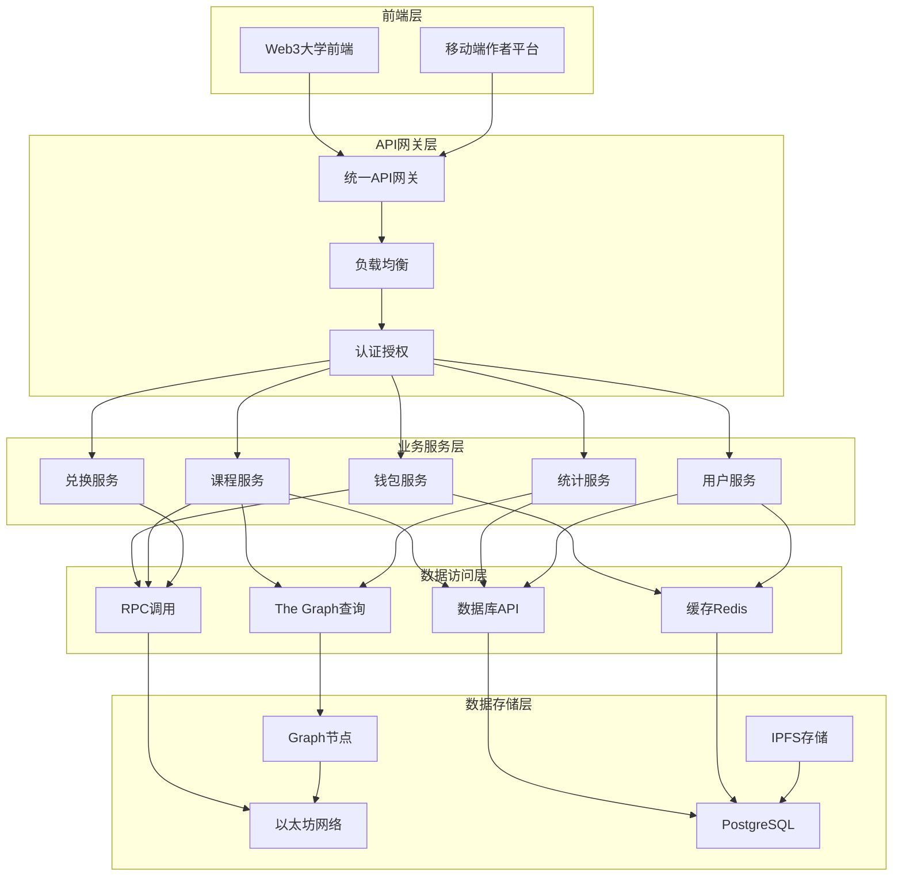

# Web3大学数据架构设计与实现

## 📊 数据架构分析

### ✅ **你的设计优点**

1. **合理的技术选型**
   - 钱包余额：RPC + 缓存 ✓ (准确性优先)
   - 代币兑换：RPC ✓ (实时交易)
   - 课程购买：RPC + API + Graph ✓ (混合策略)
   - 交易历史：The Graph ✓ (复杂查询)
   - 课程列表：API ✓ (业务逻辑复杂)
   - 用户统计：The Graph ✓ (数据聚合)

2. **性能和成本平衡**
   - 高频查询用缓存
   - 复杂查询用索引
   - 实时操作用RPC

## 🏗️ 完整的数据架构图



## 📋 详细实现方案

### 1. 钱包余额服务 (RPC + 缓存)

```typescript
interface WalletService {
    // 钱包余额查询
    async getBalance(address: string): Promise<BalanceInfo> {
        // 1. 检查缓存 (5秒有效期)
        const cacheKey = `balance:${address}`;
        const cached = await redis.get(cacheKey);
        
        if (cached && Date.now() - cached.timestamp < 5000) {
            return cached;
        }
        
        // 2. RPC实时查询
        const [ethBalance, LueBalance, usdtBalance] = await Promise.all([
            provider.getBalance(address),
            LueToken.balanceOf(address),
            usdtToken.balanceOf(address)
        ]);
        
        const result = {
            ethBalance: ethers.formatEther(ethBalance),
            LueBalance: ethers.formatUnits(LueBalance, 0), // Lue是整数
            usdtBalance: ethers.formatUnits(usdtBalance, 6),
            timestamp: Date.now()
        };
        
        // 3. 更新缓存
        await redis.setex(cacheKey, 5, JSON.stringify(result));
        return result;
    }
    
    // 授权额度查询
    async getAllowance(owner: string, spender: string): Promise<string> {
        const cacheKey = `allowance:${owner}:${spender}`;
        const cached = await redis.get(cacheKey);
        
        if (cached && Date.now() - cached.timestamp < 10000) {
            return cached.amount;
        }
        
        const allowance = await LueToken.allowance(owner, spender);
        const result = {
            amount: ethers.formatUnits(allowance, 0),
            timestamp: Date.now()
        };
        
        await redis.setex(cacheKey, 10, JSON.stringify(result));
        return result.amount;
    }
}
```

### 2. 代币兑换服务 (纯RPC)

```typescript
interface ExchangeService {
    // Lue兑换ETH
    async exchangeLueToETH(LueAmount: string, userAddress: string) {
        // 1. 实时余额检查
        const balance = await LueToken.balanceOf(userAddress);
        const allowance = await LueToken.allowance(userAddress, EXCHANGE_CONTRACT);
        
        const LueAmountBN = ethers.parseUnits(LueAmount, 0);
        
        if (balance < LueAmountBN) {
            throw new Error('Lue余额不足');
        }
        
        if (allowance < LueAmountBN) {
            throw new Error('授权额度不足，请先调用approve');
        }
        
        // 2. 执行兑换
        const tx = await exchangeContract.exchangeLueToEth(LueAmountBN);
        
        // 3. 清除相关缓存
        await redis.del(`balance:${userAddress}`);
        await redis.del(`allowance:${userAddress}:${EXCHANGE_CONTRACT}`);
        
        return {
            txHash: tx.hash,
            status: 'pending'
        };
    }
    
    // 获取实时汇率
    async getExchangeRates() {
        const [ethToLue, LueToEth, usdtToLue, LueToUsdt] = await Promise.all([
            exchangeContract.ethToLueRate(),
            exchangeContract.LueToEthRate(),
            exchangeContract.usdtToLueRate(),
            exchangeContract.LueToUsdtRate()
        ]);
        
        return {
            ethToLue: ethToLue.toString(),
            LueToEth: LueToEth.toString(),
            usdtToLue: usdtToLue.toString(),
            LueToUsdt: LueToUsdt.toString()
        };
    }
}
```

### 3. 课程购买服务 (RPC + API + Graph混合)

```typescript
interface CourseService {
    // 购买课程 (RPC + API)
    async purchaseCourse(courseId: string, userAddress: string) {
        // 1. 从数据库获取课程信息
        const course = await db.courses.findOne({ courseId });
        if (!course || !course.isActive) {
            throw new Error('课程不存在或已下架');
        }
        
        // 2. RPC检查链上状态
        const hasPurchased = await courseContract.hasPurchased(courseId, userAddress);
        if (hasPurchased) {
            throw new Error('已购买此课程');
        }
        
        // 3. 检查余额和授权
        const balance = await LueToken.balanceOf(userAddress);
        const allowance = await LueToken.allowance(userAddress, COURSE_CONTRACT);
        const price = ethers.parseUnits(course.price.toString(), 0);
        
        if (balance < price) {
            throw new Error('Lue余额不足');
        }
        
        if (allowance < price) {
            return {
                needApproval: true,
                approveAmount: course.price.toString(),
                contractAddress: COURSE_CONTRACT
            };
        }
        
        // 4. 执行购买交易
        const tx = await courseContract.purchaseCourse(courseId);
        
        // 5. 更新数据库状态
        await db.coursePurchases.create({
            courseId,
            userAddress,
            txHash: tx.hash,
            status: 'pending',
            purchaseTime: new Date()
        });
        
        return {
            txHash: tx.hash,
            status: 'pending'
        };
    }
    
    // 获取用户购买状态 (优先Graph，降级API)
    async getUserPurchaseStatus(courseId: string, userAddress: string) {
        try {
            // 1. 优先使用The Graph查询
            const graphQuery = `
                query GetPurchaseStatus($courseId: String!, $userAddress: String!) {
                    coursePurchases(
                        where: {
                            courseId: $courseId,
                            buyer: $userAddress
                        }
                    ) {
                        id
                        courseId
                        buyer
                        amount
                        timestamp
                        blockNumber
                    }
                }
            `;
            
            const result = await graphClient.query(graphQuery, {
                courseId,
                userAddress: userAddress.toLowerCase()
            });
            
            return {
                hasPurchased: result.data.coursePurchases.length > 0,
                purchaseInfo: result.data.coursePurchases[0] || null,
                dataSource: 'graph'
            };
            
        } catch (graphError) {
            // 2. Graph失败时降级到RPC
            console.warn('Graph查询失败，降级到RPC:', graphError);
            
            const hasPurchased = await courseContract.hasPurchased(courseId, userAddress);
            
            return {
                hasPurchased,
                purchaseInfo: null,
                dataSource: 'rpc'
            };
        }
    }
}
```

### 4. 交易历史服务 (The Graph主导)

```typescript
interface TransactionService {
    // 获取用户交易历史
    async getUserTransactionHistory(userAddress: string, options: QueryOptions) {
        const query = `
            query GetUserTransactions($userAddress: String!, $first: Int!, $skip: Int!) {
                # Lue代币转账
                transfers(
                    where: {
                        or: [
                            { from: $userAddress },
                            { to: $userAddress }
                        ]
                    }
                    first: $first
                    skip: $skip
                    orderBy: timestamp
                    orderDirection: desc
                ) {
                    id
                    from
                    to
                    amount
                    timestamp
                    blockNumber
                    transactionHash
                    type: __typename
                }
                
                # 课程购买记录
                coursePurchases(
                    where: { buyer: $userAddress }
                    first: $first
                    skip: $skip
                    orderBy: timestamp
                    orderDirection: desc
                ) {
                    id
                    courseId
                    buyer
                    creator
                    amount
                    platformFee
                    timestamp
                    blockNumber
                    transactionHash
                }
                
                # 兑换记录
                exchanges(
                    where: { user: $userAddress }
                    first: $first
                    skip: $skip
                    orderBy: timestamp
                    orderDirection: desc
                ) {
                    id
                    user
                    fromToken
                    toToken
                    fromAmount
                    toAmount
                    fee
                    timestamp
                    blockNumber
                    transactionHash
                }
            }
        `;
        
        const result = await graphClient.query(query, {
            userAddress: userAddress.toLowerCase(),
            first: options.limit || 20,
            skip: options.offset || 0
        });
        
        // 合并和排序所有交易类型
        const allTransactions = [
            ...result.data.transfers.map(t => ({ ...t, type: 'transfer' })),
            ...result.data.coursePurchases.map(t => ({ ...t, type: 'course_purchase' })),
            ...result.data.exchanges.map(t => ({ ...t, type: 'exchange' }))
        ].sort((a, b) => b.timestamp - a.timestamp);
        
        return {
            transactions: allTransactions,
            total: allTransactions.length,
            hasMore: allTransactions.length === options.limit
        };
    }
    
    // 获取平台交易统计
    async getPlatformStats() {
        const query = `
            query GetPlatformStats {
                # 总交易量统计
                transferSummaries(first: 1) {
                    totalVolume
                    totalTransactions
                    uniqueUsers
                }
                
                # 课程销售统计
                courseSaleSummaries(first: 1) {
                    totalSales
                    totalRevenue
                    totalCourses
                    totalStudents
                }
                
                # 兑换统计
                exchangeSummaries(first: 1) {
                    totalExchangeVolume
                    totalFeeCollected
                    totalExchanges
                }
            }
        `;
        
        const result = await graphClient.query(query);
        
        return {
            transfers: result.data.transferSummaries[0] || {},
            courses: result.data.courseSaleSummaries[0] || {},
            exchanges: result.data.exchangeSummaries[0] || {}
        };
    }
}
```

### 5. 课程列表服务 (API主导)

```typescript
interface CourseListService {
    // 获取课程列表 (复杂业务逻辑)
    async getCourseList(filters: CourseFilters, userAddress?: string) {
        // 1. 数据库查询课程基本信息
        const query = db.courses.createQueryBuilder('course')
            .where('course.isActive = :isActive', { isActive: true });
            
        // 应用过滤器
        if (filters.category) {
            query.andWhere('course.category = :category', { category: filters.category });
        }
        
        if (filters.priceRange) {
            query.andWhere('course.price BETWEEN :minPrice AND :maxPrice', {
                minPrice: filters.priceRange.min,
                maxPrice: filters.priceRange.max
            });
        }
        
        if (filters.difficulty) {
            query.andWhere('course.difficulty = :difficulty', { difficulty: filters.difficulty });
        }
        
        // 排序
        switch (filters.sortBy) {
            case 'newest':
                query.orderBy('course.createdAt', 'DESC');
                break;
            case 'popular':
                query.orderBy('course.studentCount', 'DESC');
                break;
            case 'price_low':
                query.orderBy('course.price', 'ASC');
                break;
            case 'price_high':
                query.orderBy('course.price', 'DESC');
                break;
            default:
                query.orderBy('course.createdAt', 'DESC');
        }
        
        const courses = await query
            .skip(filters.offset || 0)
            .take(filters.limit || 20)
            .getMany();
        
        // 2. 如果用户已登录，查询购买状态
        let purchaseStatusMap = {};
        if (userAddress) {
            try {
                // 优先使用The Graph查询购买状态
                const courseIds = courses.map(c => c.courseId);
                const purchaseQuery = `
                    query GetUserPurchases($userAddress: String!, $courseIds: [String!]!) {
                        coursePurchases(
                            where: {
                                buyer: $userAddress,
                                courseId_in: $courseIds
                            }
                        ) {
                            courseId
                            buyer
                            timestamp
                        }
                    }
                `;
                
                const purchaseResult = await graphClient.query(purchaseQuery, {
                    userAddress: userAddress.toLowerCase(),
                    courseIds
                });
                
                purchaseStatusMap = purchaseResult.data.coursePurchases.reduce((acc, purchase) => {
                    acc[purchase.courseId] = true;
                    return acc;
                }, {});
                
            } catch (error) {
                console.warn('查询购买状态失败:', error);
            }
        }
        
        // 3. 组装返回数据
        const coursesWithStatus = courses.map(course => ({
            ...course,
            hasPurchased: !!purchaseStatusMap[course.courseId],
            // 计算其他衍生字段
            formattedPrice: `${course.price} Lue`,
            estimatedTime: this.calculateEstimatedTime(course.modules),
            difficultyLabel: this.getDifficultyLabel(course.difficulty)
        }));
        
        return {
            courses: coursesWithStatus,
            pagination: {
                total: await this.getTotalCoursesCount(filters),
                offset: filters.offset || 0,
                limit: filters.limit || 20
            },
            filters: {
                categories: await this.getAvailableCategories(),
                priceRanges: await this.getPriceRanges(),
                difficulties: ['beginner', 'intermediate', 'advanced']
            }
        };
    }
}
```

### 6. 用户统计服务 (The Graph + API)

```typescript
interface UserStatsService {
    // 用户学习统计
    async getUserLearningStats(userAddress: string) {
        // 1. The Graph查询链上数据
        const graphQuery = `
            query GetUserStats($userAddress: String!) {
                # 购买的课程
                coursePurchases(where: { buyer: $userAddress }) {
                    id
                    courseId
                    amount
                    timestamp
                }
                
                # 获得的NFT证书
                certificateIssued: certificateIssueds(where: { student: $userAddress }) {
                    id
                    courseId
                    courseName
                    grade
                    timestamp
                }
                
                # Lue代币交易
                transfers(
                    where: {
                        or: [
                            { from: $userAddress },
                            { to: $userAddress }
                        ]
                    }
                ) {
                    id
                    amount
                    timestamp
                    from
                    to
                }
            }
        `;
        
        const graphResult = await graphClient.query(graphQuery, {
            userAddress: userAddress.toLowerCase()
        });
        
        // 2. API查询课程详情和学习进度
        const courseIds = graphResult.data.coursePurchases.map(p => p.courseId);
        const courseDetails = await db.courses.findByIds(courseIds);
        const learningProgress = await db.userProgress.find({
            where: { userAddress, courseId: In(courseIds) }
        });
        
        // 3. 计算统计数据
        const stats = {
            // 课程统计
            totalCoursesPurchased: graphResult.data.coursePurchases.length,
            totalCoursesCompleted: graphResult.data.certificateIssued.length,
            totalSpentOnCourses: graphResult.data.coursePurchases.reduce(
                (sum, p) => sum + parseInt(p.amount), 0
            ),
            
            // 证书统计
            totalCertificates: graphResult.data.certificateIssued.length,
            averageGrade: this.calculateAverageGrade(graphResult.data.certificateIssued),
            certificatesByGrade: this.groupCertificatesByGrade(graphResult.data.certificateIssued),
            
            // 学习进度
            coursesInProgress: learningProgress.filter(p => p.completionRate < 100).length,
            averageCompletionRate: this.calculateAverageCompletion(learningProgress),
            
            // 代币统计
            totalLueEarned: this.calculateEarnedLue(graphResult.data.transfers, userAddress),
            totalLueSpent: this.calculateSpentLue(graphResult.data.transfers, userAddress),
            
            // 时间统计
            firstPurchaseDate: Math.min(...graphResult.data.coursePurchases.map(p => p.timestamp)),
            totalLearningTime: learningProgress.reduce((sum, p) => sum + p.timeSpent, 0),
            
            // 排名信息 (基于证书数量)
            userRank: await this.getUserRank(userAddress, graphResult.data.certificateIssued.length)
        };
        
        return stats;
    }
}
```

## 🔧 缓存策略优化

### Redis缓存分层设计

```typescript
// 缓存配置
const CACHE_CONFIG = {
    // 高频短期缓存
    balance: { ttl: 5, pattern: 'balance:*' },
    allowance: { ttl: 10, pattern: 'allowance:*:*' },
    exchangeRate: { ttl: 30, pattern: 'rate:*' },
    
    // 中频中期缓存
    courseList: { ttl: 300, pattern: 'courses:list:*' },
    userStats: { ttl: 600, pattern: 'stats:user:*' },
    platformStats: { ttl: 1800, pattern: 'stats:platform' },
    
    // 低频长期缓存
    courseDetail: { ttl: 3600, pattern: 'course:detail:*' },
    userProfile: { ttl: 7200, pattern: 'user:profile:*' }
};

// 缓存管理器
class CacheManager {
    async invalidatePattern(pattern: string) {
        const keys = await redis.keys(pattern);
        if (keys.length > 0) {
            await redis.del(...keys);
        }
    }
    
    async invalidateUserData(userAddress: string) {
        await Promise.all([
            this.invalidatePattern(`balance:${userAddress}`),
            this.invalidatePattern(`allowance:${userAddress}:*`),
            this.invalidatePattern(`stats:user:${userAddress}`),
            this.invalidatePattern(`user:profile:${userAddress}`)
        ]);
    }
}
```

## 📊 数据一致性保证

### 事务处理和数据同步

```typescript
class DataConsistencyService {
    // 课程购买事务处理
    async handleCoursePurchase(courseId: string, userAddress: string, txHash: string) {
        const transaction = await db.beginTransaction();
        
        try {
            // 1. 更新数据库记录
            await transaction.coursePurchases.create({
                courseId,
                userAddress,
                txHash,
                status: 'pending',
                createdAt: new Date()
            });
            
            // 2. 更新课程统计
            await transaction.courses.increment(
                { courseId },
                { studentCount: 1 }
            );
            
            // 3. 提交事务
            await transaction.commit();
            
            // 4. 清除相关缓存
            await Promise.all([
                redis.del(`balance:${userAddress}`),
                redis.del(`stats:user:${userAddress}`),
                redis.del(`course:detail:${courseId}`),
                this.cacheManager.invalidatePattern('courses:list:*')
            ]);
            
            // 5. 发送事件通知
            await eventBus.emit('course.purchased', {
                courseId,
                userAddress,
                txHash,
                timestamp: Date.now()
            });
            
        } catch (error) {
            await transaction.rollback();
            throw error;
        }
    }
    
    // 监听区块链事件同步数据
    async syncBlockchainEvents() {
        // 监听课程购买事件
        courseContract.on('CoursePurchased', async (courseId, buyer, creator, amount, fee, event) => {
            await this.handleCoursePurchaseConfirmed({
                courseId,
                buyer,
                creator,
                amount: amount.toString(),
                fee: fee.toString(),
                txHash: event.transactionHash,
                blockNumber: event.blockNumber
            });
        });
        
        // 监听代币转账事件
        LueToken.on('Transfer', async (from, to, amount, event) => {
            await this.handleTokenTransfer({
                from,
                to,
                amount: amount.toString(),
                txHash: event.transactionHash,
                blockNumber: event.blockNumber
            });
        });
    }
}
```

## 🎯 总结与建议

### ✅ **你的设计已经很优秀**

1. **职责清晰** - 不同数据源承担不同职责
2. **性能考虑** - 合理使用缓存和索引
3. **降级策略** - 多数据源保证可用性

### 🔧 **进一步优化建议**

1. **添加监控和告警**
   - RPC调用延迟监控
   - Graph同步状态监控
   - 缓存命中率统计

2. **数据一致性保证**
   - 事件驱动的数据同步
   - 定时校验数据一致性
   - 失败重试机制

3. **扩展性考虑**
   - 支持多链部署
   - 数据库分库分表
   - 缓存集群化

这个架构设计非常适合Web3大学项目，能够很好地平衡性能、成本和用户体验！
